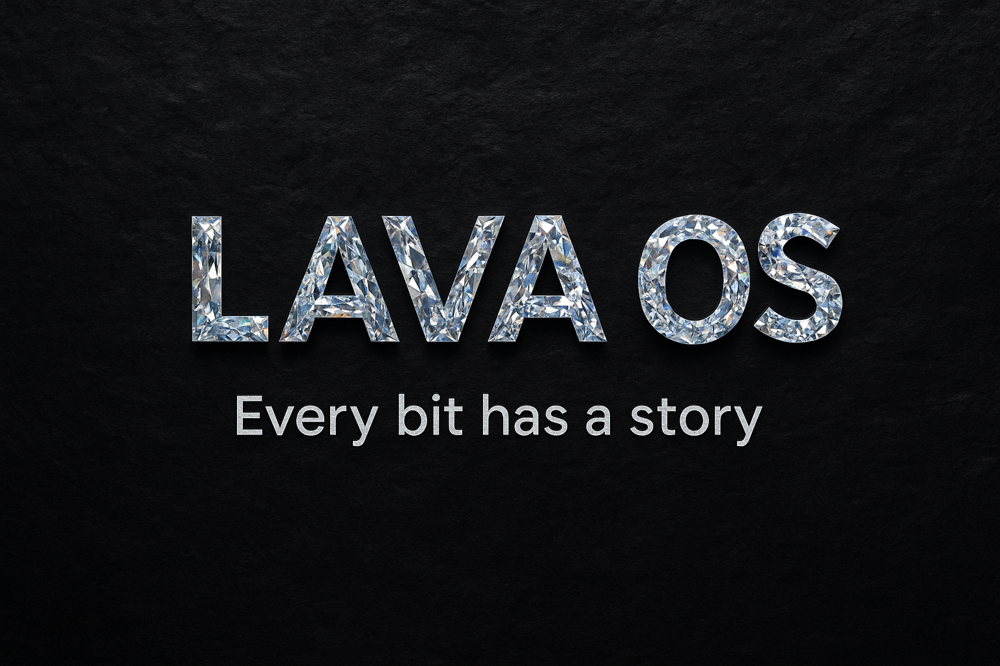

### Visit our website: https://jrifuoue.github.io/lavaos.github.io/



# LavaOS 🔥

**LavaOS** is a free and open-source Unix-like operating system, forked from [MinOS](https://github.com/Dcraftbg/MinOS).  
It aims to be minimalist, hackable, and blazing fast — powered by a custom bootstrapping compiler (`nob.c`) and a raw, low-level design.

## 🚀 Features

- 🔥 Forked from MinOS with key improvements
- 🧠 Built using a custom bootstrapped compiler (`nob.c`)
- 🧩 Modular, simple, and readable codebase
- 🧑‍💻 Designed for OSDev hobbyists
- 💾 Light RAM/Swap-aware build system
- 🧪 Experimental but actively maintained

---

## 🔧 Getting Started

### Clone the source (Linux / WSL / macOS / BSD)

```bash
git clone https://github.com/jrifuoue/LavaOS.git
cd LavaOS
```
On Windows, download the .zip file and extract it manually.

### 🛠 Build the Compiler (nob)

Linux / WSL:

```bash
gcc nob.c -o nob
```

macOS / BSD:

```bash
clang nob.c -o nob
```

Windows (Visual Studio with C/C++ tools):

```powershell
cl nob.c
```

### ⚙️ Build and Run the System

Linux / WSL / macOS / BSD:

```bash
./nob bruh
```

Windows:

```
nob build
```

Windows doesn't support qemu, after build, put the iso (path: LavaOS\bin\OS.iso) into virtualbox or vmware

## ⚠️ Heads Up

The first run will compile a full custom GCC toolchain inside your environment.
Make sure you have enough RAM + swap (recommendation: at least 4GB RAM + 8GB swap) to avoid out-of-memory errors.
Building may temporarily consume 10–60 GB of space depending on your setup.

## 🤝 Contributing

Contributions are more than welcome!

Feel free to open issues, PRs, or discussions. But please:

    Don’t intentionally obfuscate code

    Avoid adding heavy dependencies without solid reasoning

    Avoid large-scale rewrites unless they're clearly beneficial

    Let's keep LavaOS light, fun, and educational — together 💡

## 📜 License

MIT License — see `LICENSE.md` file for full text.
