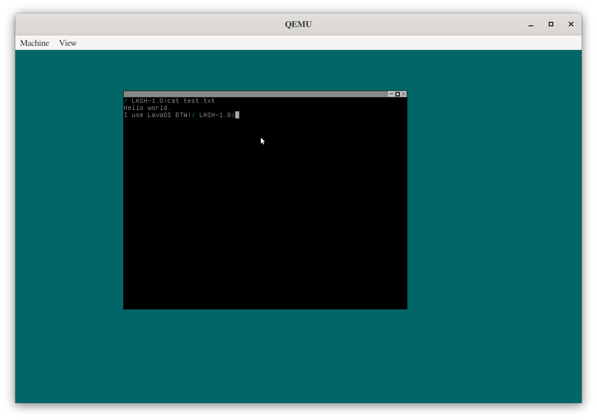
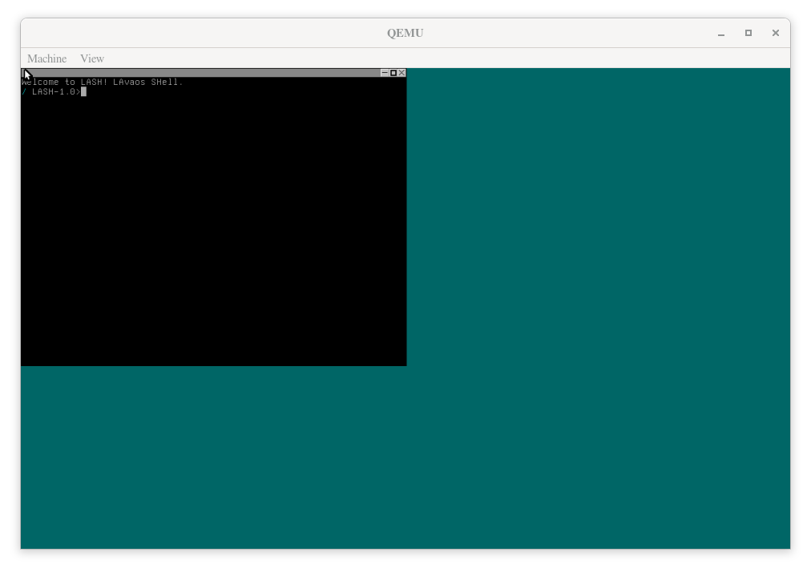
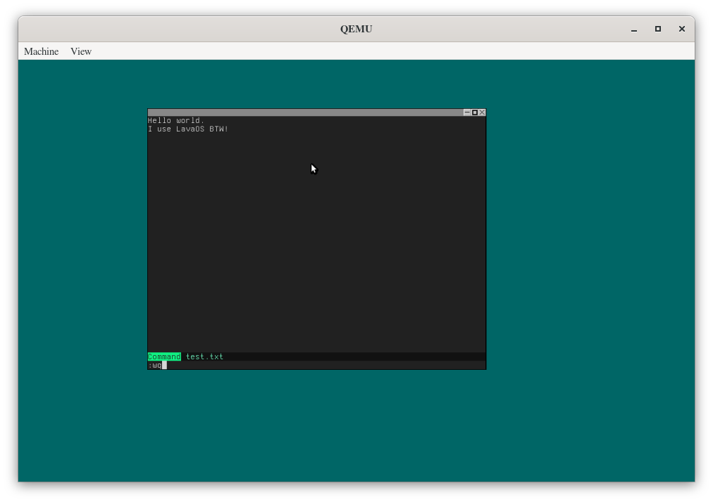
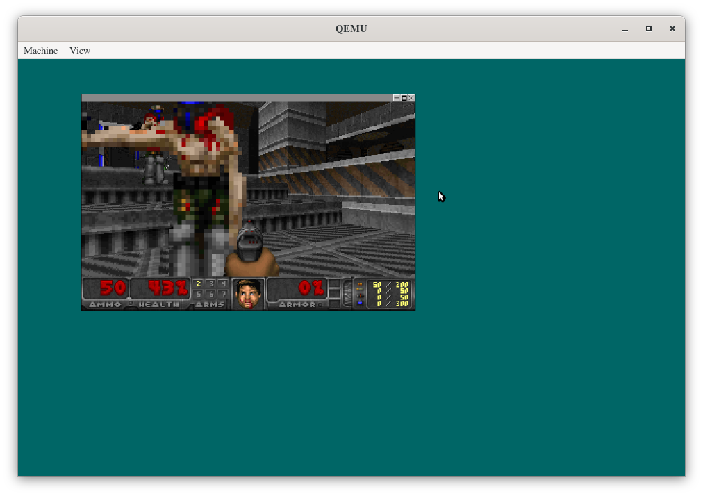

## 📜 Licensing

- The source code of this project is licensed under the **GNU General Public License v3.0 (GPL-3.0)**.  
- This project includes third-party code:  
  - [MinOS](https://github.com/Dcraftbg/MinOS) by Dcraftbg, licensed under the **MIT License** (see `licenses/LICENSE.MINOS`).  
  - [Limine Bootloader](https://github.com/limine-bootloader/limine), licensed under the **BSD 3-Clause License** (see `kernel/vendor/limine/LICENSE`).  
  - [Doomgeneric (Ported by dcraftbg)](https://github.com/Dcraftbg/doomgeneric), licensed under the **GPLv2 License** (see `user/doomgeneric/LICENSE`).
  - [DIM text editor (By dcraftbg)](https://github.com/Dcraftbg/dim), licensed under the **MIT License** (see `licenses/LICENSE.DIM`).
  - [Sinux Kernel (amirh1385 fork, Original project: https://github.com/CyberSinook/Sinux)](https://github.com/amirh1385/Sinux), licensed under the **MIT License** (see `licenses/LICENSE.SINUX`).
- All third-party licenses are preserved in this repository as required.

### ⚠️ Visit our website:
https://lavaos.github.io/getlavaos/

## ⚠️ Important announcement
The ISO files were removed from GitHub and uploaded to the MEGA platform.
MEGA folder link: https://mega.nz/folder/bQEhmZqb#LN9cA3Qu-dyBoR8jMR_9zQ
Nightly branch: https://mega.nz/folder/WAVDzAAR#0A-jnREK9e3MMW2p7oHgDA


# 🔥 LavaOS

**LavaOS** is a free and open-source Unix-like operating system, forked from [MinOS](https://github.com/Dcraftbg/MinOS).  
It aims to be minimalist, hackable, and blazing fast — powered by a custom bootstrapping compiler (`nob.c`) and a raw, low-level design.

## Screenshots






## 🚀 Features

- 🔥 Forked from MinOS with key improvements
- 🧠 Built using a custom bootstrapped compiler (`nob.c`)
- 🧩 Modular, simple, and readable codebase
- 🧑‍💻 Designed for OSDev hobbyists
- 💾 Light RAM/Swap-aware build system
- 🧪 Experimental but actively maintained

---

## 🔧 Getting Started

Highly recommended distro for build: archlinux

### 💾 Clone the source

```bash
git clone https://github.com/LavaOS/LavaOS.git
cd LavaOS
```
### 🛠 Build the Compiler (nob)

```bash
gcc nob.c -o nob
```
### ⚙️ Build and Run the System

```bash
./nob bruh
```
## ⚠️ Heads Up

The first run will compile a full custom GCC toolchain inside your environment.
Make sure you have enough RAM + swap (recommendation: at least 4GiB RAM + 8GiB swap) to avoid out-of-memory errors.
Building may temporarily consume 1–10 GiB of space depending on your setup.

## 🤝 Contributing

Contributions are more than welcome!

Feel free to open issues, PRs, or discussions. But please:

    Don’t intentionally obfuscate code

    Avoid adding heavy dependencies without solid reasoning

    Avoid large-scale rewrites unless they're clearly beneficial

    Let's keep LavaOS light, fun, and educational — together 💡
